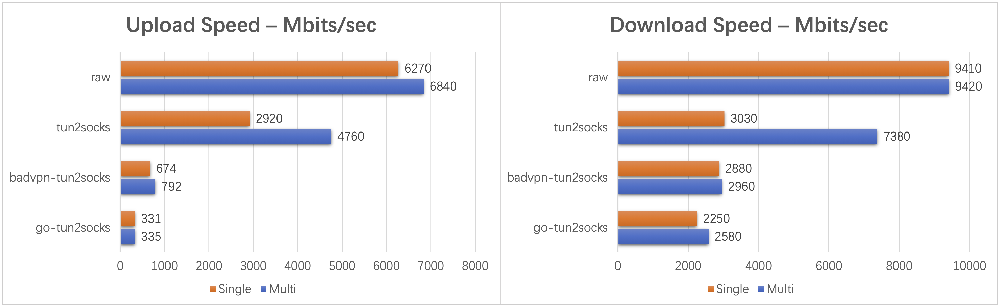

[![GitHub Workflow][1]](https://github.com/xjasonlyu/tun2socks/actions)
[![Go Version][2]](https://github.com/xjasonlyu/tun2socks/blob/main/go.mod)
[![Go Report][3]](https://goreportcard.com/badge/github.com/xjasonlyu/tun2socks)
[![Maintainability][4]](https://codeclimate.com/github/xjasonlyu/tun2socks/maintainability)
[![GitHub License][5]](https://github.com/xjasonlyu/tun2socks/blob/main/LICENSE)
[![Docker Pulls][6]](https://hub.docker.com/r/xjasonlyu/tun2socks)
[![Releases][7]](https://github.com/xjasonlyu/tun2socks/releases)

## Features

- **Universal Proxying**: Transparently routes all network traffic from any application through a proxy.
- **Multi-Protocol**: Supports HTTP/SOCKS4/SOCKS5/Shadowsocks proxies with optional authentication.
- **Cross-Platform**: Runs on Linux/macOS/Windows/FreeBSD/OpenBSD with platform-specific optimizations.
- **Gateway Mode**: Acts as a Layer 3 gateway to route traffic from other devices on the same network.
- **Full IPv6 Compatibility**: Natively supports IPv6; seamlessly tunnels IPv4 over IPv6 and vice versa.
- **User-Space Networking**: Leverages the **[gVisor](https://github.com/google/gvisor)** network stack for enhanced
  performance and flexibility.

## Benchmarks

For all scenarios of usage, tun2socks performs best.
See [benchmarks](https://github.com/xjasonlyu/tun2socks/wiki/Benchmarks) for more details.

## Documentation

- [Install from Source](https://github.com/xjasonlyu/tun2socks/wiki/Install-from-Source)
- [Quickstart Examples](https://github.com/xjasonlyu/tun2socks/wiki/Examples)
- [Memory Optimization](https://github.com/xjasonlyu/tun2socks/wiki/Memory-Optimization)

Full documentation and technical guides can be found at [Wiki](https://github.com/xjasonlyu/tun2socks/wiki).

## Community

Welcome and feel free to ask any questions at [Discussions](https://github.com/xjasonlyu/tun2socks/discussions).

## Credits

- [google/gvisor](https://github.com/google/gvisor) - Application Kernel for Containers
- [wireguard-go](https://git.zx2c4.com/wireguard-go) - Go Implementation of WireGuard
- [wintun](https://git.zx2c4.com/wintun/) - Layer 3 TUN Driver for Windows

## License

All versions starting from `v2.6.0` are available under the terms of the [MIT License](https://github.com/xjasonlyu/tun2socks/blob/main/LICENSE).

## Star History

<a href="https://star-history.com/#xjasonlyu/tun2socks&Date">
  <picture>
    <source media="(prefers-color-scheme: dark)" srcset="https://api.star-history.com/svg?repos=xjasonlyu/tun2socks&type=Date&theme=dark" />
    <source media="(prefers-color-scheme: light)" srcset="https://api.star-history.com/svg?repos=xjasonlyu/tun2socks&type=Date" />
    
  </picture>
</a>

[1]: https://img.shields.io/github/actions/workflow/status/xjasonlyu/tun2socks/docker.yml?logo=github

[2]: https://img.shields.io/github/go-mod/go-version/xjasonlyu/tun2socks?logo=go

[3]: https://goreportcard.com/badge/github.com/xjasonlyu/tun2socks

[4]: https://api.codeclimate.com/v1/badges/b5b30239174fc6603aca/maintainability

[5]: https://img.shields.io/github/license/xjasonlyu/tun2socks

[6]: https://img.shields.io/docker/pulls/xjasonlyu/tun2socks?logo=docker

[7]: https://img.shields.io/github/v/release/xjasonlyu/tun2socks?logo=smartthings
