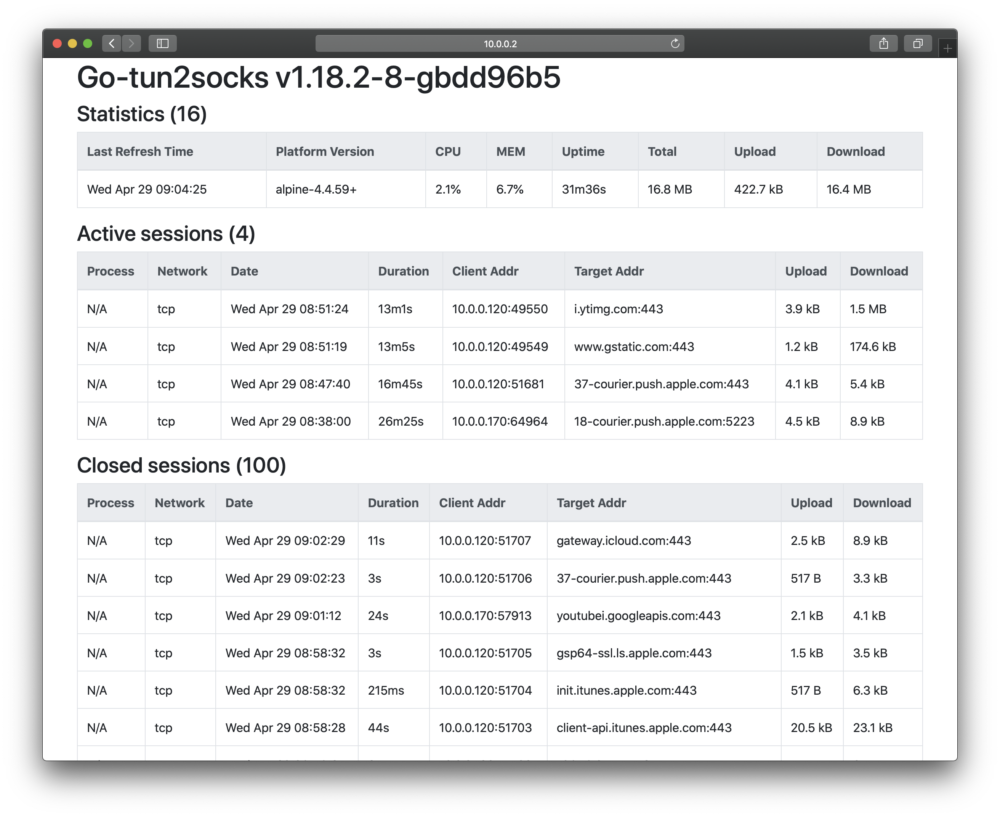

# tun2socks

A tun2socks implementation written in Go.

forked & modified from [eycorsican/go-tun2socks](https://github.com/eycorsican/go-tun2socks)

## Preview
Tun2socks status web view (`-monitor` option is required)


## What's the difference with the original project
- Add new features (listed below)
- Optimize handlers (e.g. new TCP/UDP proxy handler)
- Rewrite and remove some implementations

## Main Features

Previous Features
- Support both TCP and UDP
- Support both IPv4 and IPv6
- Support proxy handler: `SOCKS5`
- ICMP echoing

New Features
- Fake DNS (Fake IP range: `198.18.0.0/15`)
- Backend DNS (resolve non-TypeA query)
- Hijack DNS (force the specific DNS to get a fake address)
- Hosts mapping (e.g. `localhost`->`127.0.0.1`)
- Web statistics monitor

## Tun2socks Usage
```
Usage of tun2socks:
  -backendDNS string
    	Backend DNS to resolve non-TypeA or non-ClassINET query (must support tcp) (default "8.8.8.8:53,8.8.4.4:53")
  -fakeDNS
    	Enable fake DNS
  -fakeDNSAddr string
    	Listen address of fake DNS (default ":53")
  -hijackDNS string
    	Hijack the specific DNS query to get a fake ip, e.g. '*:53', '8.8.8.8:53,8.8.4.4:53'
  -hosts string
    	DNS hosts mapping, e.g. 'example.com=1.1.1.1,example.net=2.2.2.2'
  -loglevel string
    	Logging level [info, warning, error, debug, silent] (default "info")
  -monitor
    	Enable session statistics monitor
  -monitorAddr string
    	Listen address of session monitor, open in your browser to view statistics (default "localhost:6001")
  -proxyServer string
    	Proxy server address
  -tunAddr string
    	TUN interface address (default "240.0.0.2")
  -tunDNS string
    	DNS resolvers for TUN interface (Windows Only) (default "8.8.8.8,8.8.4.4")
  -tunGw string
    	TUN interface gateway (default "240.0.0.1")
  -tunMask string
    	TUN interface netmask (default "255.255.255.0")
  -tunName string
    	TUN interface name (default "utun0")
  -tunPersist
    	Persist TUN interface after the program exits or the last open file descriptor is closed (Linux only)
  -udpTimeout duration
    	UDP session timeout (default 30s)
  -version
    	Show current version of tun2socks
```

## How to Build

`go-tun2socks` is using `cgo` and `go modules`, thus a C compiler and GO version >= 1.13 are required.

```sh
git clone https://github.com/xjasonlyu/tun2socks.git
cd tun2socks && go mod download
make clean && make build
./bin/tun2socks -h
```

## My Daily Using (Alpine Demo)
This project is running on my server as a second gateway, so my Apple TV and other devices could access the full internet and AD block function without complex configuration.

Here is my Running Environment
- Linux alpine 4.19.79-0-virt (VM)
- Proxy Server: 10.0.0.3
- Alpine Address: 10.0.0.2
- Router Gateway: 10.0.0.1
- Apple TV Address: 10.0.0.120

<details>
    <summary>This is my alpine tun2socks service file</summary>

```sh
#!/sbin/openrc-run

### tun2socks options
TUN="utun0"
ETH="eth0"
ETHGW="10.0.0.1"
TUNGW="240.0.0.1"
SOCKS="10.0.0.3:1080"
MONITOR="0.0.0.0:80"
HIJACKDNS=""
BACKENDDNS="1.2.4.8:53,1.1.1.1:53"
HOSTS="localhost=127.0.0.1"
OPTIONS="-loglevel warning -tunName $TUN -proxyServer $SOCKS -monitor -monitorAddr $MONITOR -fakeDNS -hosts $HOSTS -backendDNS $BACKENDDNS"

### openrc options
description="the tun2socks route process"
name=$RC_SVCNAME
pidfile="/var/run/$RC_SVCNAME.pid"
logfile="/var/log/$RC_SVCNAME.log"
command="/usr/local/bin/tun2socks"
command_args=$OPTIONS
command_user="root"
command_background="yes"

depend() {
    #after *
    before chronyd
    after firewall
    use dns
}

_set_dns() {
    option=$1
    case $option in
        0)
        einfo "DNS settings updated"
        [ -f /etc/resolv.conf.copy ] || mv /etc/resolv.conf /etc/resolv.conf.copy
        cat > /etc/resolv.conf << EOF
nameserver $TUNGW
EOF
        ;;
        1)
        einfo "DNS settings restored"
        cp -f /etc/resolv.conf.copy /etc/resolv.conf
        ;;
        *)
        return 0
        ;;
    esac
    eend $?
}

start_pre() {
    if [ "${RC_CMD}" = "restart" ]; then
        ip link delete $TUN 2> /dev/null
    fi

    # enable ip_forward
    einfo $(sysctl -w net.ipv4.ip_forward=1) && eend $?

    # create tun device
    ip tuntap add mode tun dev $TUN
    ip addr add $TUNGW/24 dev $TUN
    ip link set dev $TUN up
    einfo "tun device created: $TUN" && eend $?

    # change default gateway
    ip route del default 2> /dev/null
    ip route add default via $TUNGW dev $TUN

    # add to ip route
    #ip route add 1.1.1.1/32 via $ETHGW

    # DNS settings
    _set_dns 0
}

stop_post() {
    # disable ip_forward
    einfo $(sysctl -w net.ipv4.ip_forward=0) && eend $?

    # delete from ip route
    #ip route del 1.1.1.1/32 via $ETHGW

    # change default gateway
    # ip route del default
    ip route add default via $ETHGW dev $ETH 2> /dev/null

    # delete tun device
    #ip link set dev $TUN down
    #ip addr del $TUNGW/24 dev $TUN
    #ip tuntap del mode tun dev $TUN
    ip link delete $TUN 2> /dev/null
    einfo "tun device deleted: $TUN" && eend $?

    # DNS settings
    _set_dns 1
}

start() {
    ebegin "Starting $RC_SVCNAME"
	start-stop-daemon --start --quiet \
        --background --exec $command \
        --user $command_user \
        --make-pidfile --pidfile $pidfile \
        --stdout $logfile --stderr $logfile \
        -- $command_args
	eend $?
}

stop() {
    if [ "${RC_CMD}" = "restart" ]; then
        _pid=$(pgrep $RC_SVCNAME)
        if [ "$_pid" != "$(cat $pidfile)" ]; then
            echo $_pid > $pidfile
        fi
    fi

	ebegin "Stopping $RC_SVCNAME"
	start-stop-daemon --stop --quiet --exec "$command" \
		--pidfile "$pidfile"
	eend $?

	if [ "$RC_RUNLEVEL" = "shutdown" ]; then
		_pid=$(pgrep $RC_SVCNAME)
        if [ -n $_pid ]; then
            kill -9 $_pid > /dev/null 2>&1
        fi
        rm -rf $pidfile
	fi
}
```

</details>

Follow 3 Steps
- Simply put this config in `/etc/init.d/`
- Give it executable permission `chmod +x tun2socks`
- Launch the service `rc-service tun2socks start`

Finally, all you need to do is modify your internet settings.

In this case, I just need configure my Apple TV internet settings from DHCP to Static, and change my gateway and DNS to `10.0.0.2`.

Done!

## Run

```sh
tun2socks -loglevel warning -tunName utun0 -proxyServer 1.2.3.4:1080 -monitor -monitorAddr 0.0.0.0:80 -fakeDNS -hosts localhost=127.0.0.1 -backendDNS 1.1.1.1:53,8.8.8.8:53
```

Note that the TUN device may have a different name, and it should be a different name on Windows unless you have renamed it, so make sure use `ifconfig`, `ipconfig` or `ip addr` to check it out.

## Create TUN device and Configure Routing Table

Suppose your original gateway is 192.168.0.1. The proxy server address is 1.2.3.4.

The following commands will need root permissions.

### macOS

The program will automatically create a TUN device for you on macOS. To show the created TUN device, use `ifconfig`.

Delete original gateway:

```sh
route delete default
```

Add our TUN interface as the default gateway:

```sh
route add default 240.0.0.1
```

Add a route for your proxy server to bypass the TUN interface:

```sh
route add 1.2.3.4/32 192.168.0.1
```

### Linux

The program will not create the TUN device for you on Linux. You need to create the TUN device by yourself:

```sh
ip tuntap add mode tun dev tun1
ip addr add 240.0.0.1 dev tun1
ip link set dev tun1 up
```

Delete original gateway:

```sh
ip route del default
```

Add our TUN interface as the default gateway:

```sh
ip route add default via 240.0.0.1
```

Add a route for your proxy server to bypass the TUN interface:

```sh
ip route add 1.2.3.4/32 via 192.168.0.1
```

### Windows

[使用教程](https://medium.com/@TachyonDevel/%E6%95%99%E7%A8%8B-%E5%9C%A8-windows-%E4%B8%8A%E4%BD%BF%E7%94%A8-tun2socks-%E8%BF%9B%E8%A1%8C%E5%85%A8%E5%B1%80%E4%BB%A3%E7%90%86-aa51869dd0d) - Tutorial in Chinese

To create a TUN device on Windows, you need [Tap-windows](http://build.openvpn.net/downloads/releases/), refer [here](https://code.google.com/archive/p/badvpn/wikis/tun2socks.wiki) for more information.

Add our TUN interface as the default gateway:

```sh
# Using 240.0.0.1 is not allowed on Windows, we use 10.0.0.1 instead
route add 0.0.0.0 mask 0.0.0.0 10.0.0.1 metric 6
```

Add a route for your proxy server to bypass the TUN interface:

```sh
route add 1.2.3.4 192.168.0.1 metric 5
```

## This project is using lwIP

This project is using a modified version of lwIP, you can checkout this repo to find out what are the changes: https://github.com/eycorsican/lwip (original author)

## Many thanks to the following projects
- https://savannah.nongnu.org/projects/lwip
- https://github.com/ambrop72/badvpn
- https://github.com/zhuhaow/tun2socks
- https://github.com/yinghuocho/gotun2socks
- https://github.com/v2ray/v2ray-core
- https://github.com/shadowsocks/go-shadowsocks2
- https://github.com/Dreamacro/clash
- https://github.com/songgao/water
- https://github.com/nadoo/glider
- https://github.com/miekg/dns
- https://github.com/sirupsen/logrus
